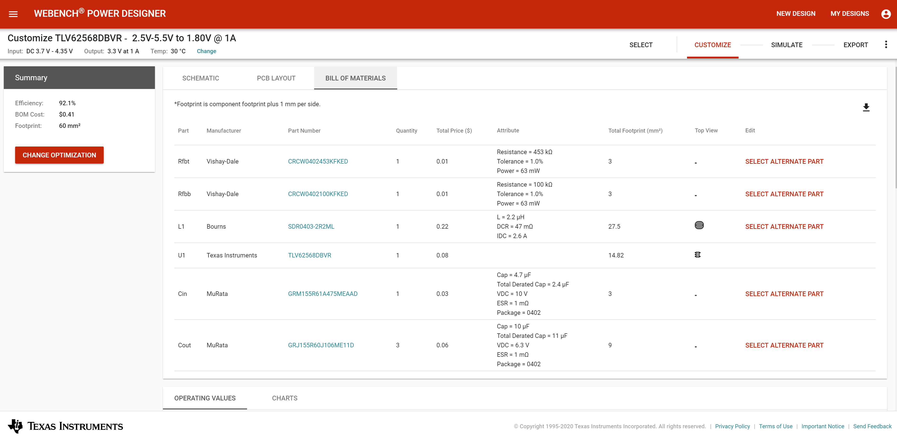
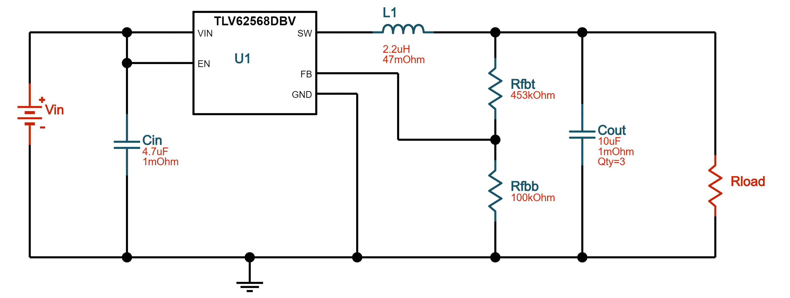
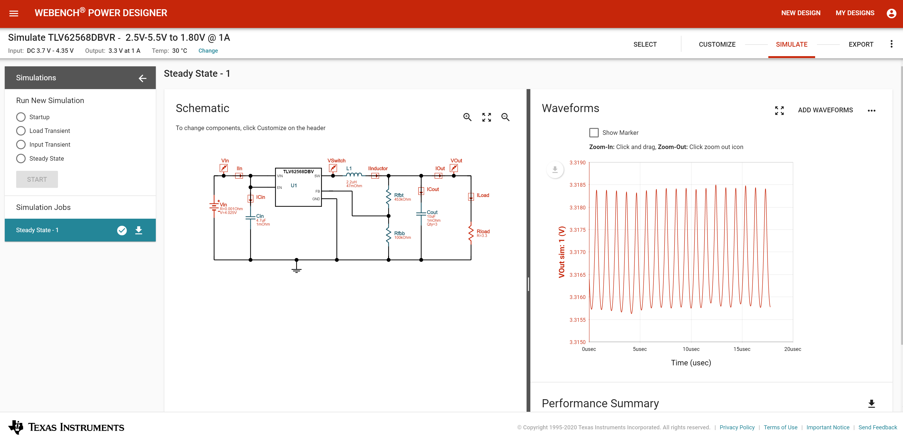
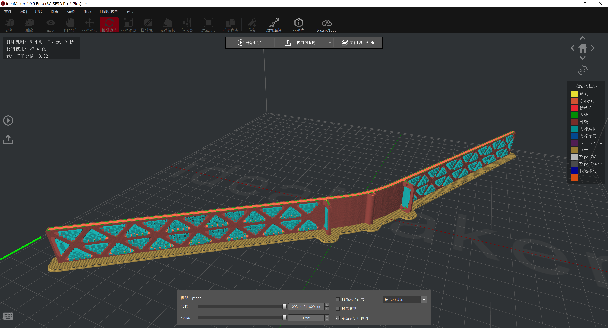
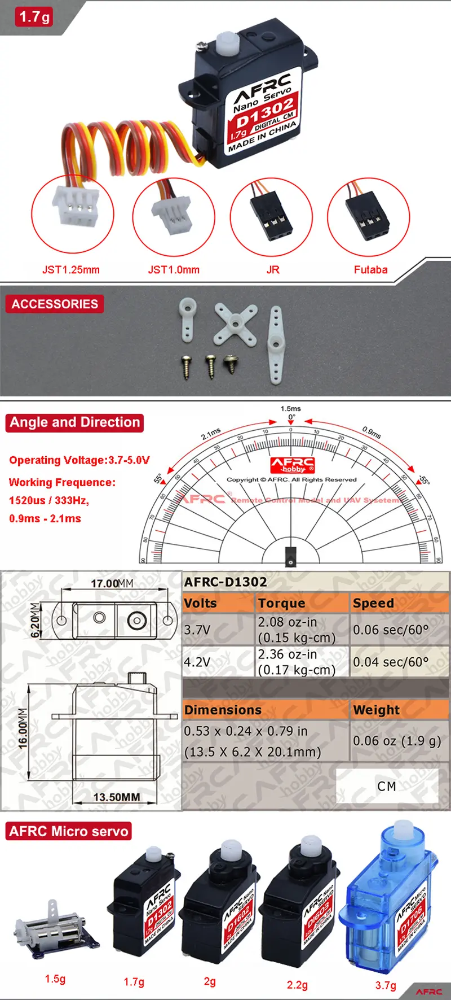
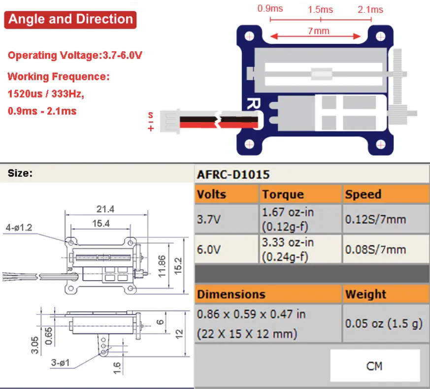

# PaperAircraft
纸飞机

https://www.poweruptoys.com/

https://www.indiegogo.com/projects/powerup-4-0-smartphone-controlled-paper-airplane--2#/

https://item.taobao.com/item.htm?id=598983848365

https://detail.1688.com/offer/623588992739.html

看了这么多产品，最后还是要自己写飞控。通信用蓝牙或者Wifi，NanoBLESense可能又要用起来了。

https://item.taobao.com/item.htm?id=580652831242

小巧的7.8g高压锂电还是要用的

1.7g微型舵机

https://item.taobao.com/item.htm?id=610628423127

参考F3P和F1D

F3P

https://ultralight.tech/

https://www.bilibili.com/video/BV1Yk4y1971W

F1D

https://www.bilibili.com/video/BV1Q5411s7f6

可以考虑用共轴反桨，但是重量有点大，如果能开发微型共轴反桨，可以搞简单的直升机雪花。

## 一些想法

激光切割卡纸

BLE广播 mesh

## V1方案

元件选型

主控板：[Arduino Nano 33 BLE Sense](https://store.arduino.cc/usa/nano-33-ble-sense-with-headers)

3.3V能否接3.8V+存疑，考虑换DCDC芯片，但是[MPM3610](https://www.monolithicpower.cn/cn/mpm3610.html)的封装是节省空间的 QFN-20 (3mmx5mmx1.6mm)封装，很难找到相应的芯片以及更换。此路不通

外接一块3.8v-3.3v DCDC转换模块，找了一圈淘宝，找到DM13B-3.3，可以升降压。

[Arduino Nano 33 BLE](https://store.arduino.cc/usa/nano-33-ble)更便宜

新解决方案！电调上面的UBEC，UBEC输出:5.2V 2A（正负0.1V），原本给接收机用的，可以用来驱动Arduino！

电池：[Happymodel 3.8V 300mAh 30C 1-2S Lipo Battery PH2.0 Plug for Mobula6/7](http://www.happymodel.cn/index.php/2018/09/22/happymodel-3-8v-300mah-30c-1-2s-lipo-battery-ph2-0-plug-for-mobula7/)

https://item.taobao.com/item.htm?id=580652831242

Capacity:300mAh

Voltage:3.8v

Continuous Discharge Rate: 30C

Instantaneous discharge rate: 60C

Size: 57mmx12mmx7mm

Weight: 6.5g

Connector: PH2.0

充电器：[Happymodel Mobula7 FPV Racing Drone Spare Part 1S06 6 Way Lipo/LIHV Battery Charger](http://www.happymodel.cn/index.php/2018/08/31/happymodel-ur65-fpv-racing-drone-spare-part-1s06-6-way-lipolihv-battery-charger/)

https://item.taobao.com/item.htm?id=566199133982

4.20v cell charging cutoff (+- 0.5% margin of error) for 1S Lipo Battery

4.35v cell charging cutoff (+- 0.5% margin of error) for 1S 3.8V LIHV Battery

电机：暂时使用劣质的1.72块钱一个的[高速航模电机马达双环强磁716空心杯电机3.7V暴力50000转包邮](https://item.taobao.com/item.htm?id=535704086171)

规格:7x16x0.8mm 额定电压：3.7V 启动电压：0.15V 额定电流：800mA 额定转速：34000

舵机：[AFRC-D1302微型1.7g舵机MINI精致1.9g航模室内飞机直升机数字舵机 ](https://item.taobao.com/item.htm?spm=a1z09.2.0.0.2afc2e8doX2vub&id=607309316067)

尺寸:13.5 x 6.2 x 20.1 mm

重量:1.7g(不含线)

工作电压:3.7~5.0V

扭力:

3.7V：2.08 oz-in (0.15 kg-cm)

4.2V：2.36 oz-in (0.17 kg-cm)
速度:

3.7V：0.06 sec/60°

4.2V：0.04 sec/60°

出线: JST1.25mm L=110mm （棕-，红+，橙S）

直线电机：[AFRC-D1015直线舵机1.5克微型轻量迷你1.5g数字舵机](https://item.taobao.com/item.htm?spm=a1z09.2.0.0.2afc2e8doX2vub&id=611726187447)

尺寸:21.4 x 15.2 x 6.0 mm

重量:1.5g(不含线)

出线: JST1.25mm L=100 mm （红+，黑-，白S）；JST1.0mm,JR,Futaba L=100 mm （棕-，红+，橙S）

工作电压:3.7~6.0V

工厂默认行程为7mm/900~2100us

电机驱动：[1S超小微型单向有刷电调航模飞机固定翼空心杯电机专用驱动控制器](https://item.taobao.com/item.htm?id=548195280709)

最多能接4个空心杯电机;N20,N30,N50,131,180电机可以接2只.。

输入电池电压:2.2V-5.2V（超过5.5V烧电调）.

最大输出电:流20A.

UBEC输出:5.2V 2A.（正负0.1V）

## V2做PCB方案

自己画：STM32 蓝牙 IMU

or ESP32WROOM + IMU

STM32选型：STM32G031K8T6 STM32G031J6M6

PCB板上外设：

1. 蓝牙透传
2. IMU（目前可选）
3. 3.8v-3.3v降压稳压芯片
4. 空心杯电机驱动芯片
5. 电池电机舵机接口

具体选型

### DCDC芯片

TI电源解决方案[选型](https://www.ti.com/design-resources/design-tools-simulation.html)网站

[WEBENCH Power Designer](http://webench.ti.com/power-designer/switching-regulator)

[TLV62569DBVR](https://item.szlcsc.com/153167.html) 2A

[TLV62568DBVR](https://item.szlcsc.com/174600.html) 1A

这个很好用，能生成原理图和BOM。

甚至仿真

https://webench.ti.com/appinfo/webench/scripts/SDP.cgi?ID=C1D9EF81C082E009

TLV62568ADRLR及其周边电路BOM

[DC-DC芯片/TPS54331DR](https://item.szlcsc.com/10397.html)

[4.7uF(475) ±10% 10V](https://item.szlcsc.com/2057.html)

[10uF(106) ±20% 6.3V](https://item.szlcsc.com/2043.html)

[453KΩ ±1%](https://item.szlcsc.com/26561.html)

[100KΩ ±5%](https://item.szlcsc.com/16137.html)

[2.2uH ±20% 47mΩ 2.6A](https://item.szlcsc.com/503279.html)

[10uF(106) ±10% 10V](https://item.szlcsc.com/20411.html)无货更换为[10uF(106) ±20% 6.3V](https://item.szlcsc.com/2043.html)

### STM32

[STM32G031J6 ](https://www.st.com/en/microcontrollers-microprocessors/stm32g031j6.html)

Internal 16 MHz RC with PLL option 这玩意内部时钟16M感觉不用加外部时钟了，除非用得到48MHz

BOOT0用10k电阻拉低接地，boot from User Flash memory

加一个RST按钮，按下拉低RST

加入一个电源指示LED，以及一个接到PB9的LED

烧写用4pin杜邦线母头，接0/3.3V/TX/RX，使用ST-Link烧写程序

STM32G031J6及其周边电路BOM：

[STM32G031K8T6](https://item.szlcsc.com/428991.html)

[轻触开关 一型3x6x2.5有白ZD b拉伸白色按键 卷装](https://item.szlcsc.com/300030.html)

[1KΩ(1001) ±1%](https://item.szlcsc.com/116573.html)

[10KΩ(1002) ±1%](https://item.szlcsc.com/116572.html)

[100nF(104) ±10% 50V](https://item.szlcsc.com/1943.html)

[22Ω ±1%](https://item.szlcsc.com/24078.html)

[翠绿LED](https://item.szlcsc.com/207066.html)

可选晶振：[SMD3225 40.000MHZ 12PF 10PPM](https://item.szlcsc.com/420977.html)

### 电机驱动

[DRV8837CDSGR](https://item.szlcsc.com/213827.html)

### IMU

Arduino上面用的[LSM9DS1TR](https://www.digikey.cn/product-detail/zh/stmicroelectronics/LSM9DS1TR/497-14946-2-ND/4988083)在Digikey上面单个47.89块钱一个，太贵了

[MPU-6050](https://item.szlcsc.com/24852.html)嘉立创商城里也是10块钱左右

好贵，暂时不加了

### 蓝牙

都好贵，考虑ESP32了

[ESP32-WROOM-32](https://item.szlcsc.com/84060.html)

深圳大夏龙雀科技的蓝牙模块便宜点，十元以内

http://www.szdx-smart.com/

暂时选型[BT04-E低成本小体积无线串口透传蓝牙模组SPP3.0+BLE4.2蓝牙模块 ](https://item.taobao.com/item.htm?id=616730393533&_u=22q6uuheaa6e)

邮票孔版本。

本来想用[BT24高性价比串口高速透传BLE5.1微安级功耗蓝牙模块迷你无线模块](https://item.taobao.com/item.htm?id=621716432187&_u=22q6uuhea153)中的 DX-BT24-M[邮票孔贴片款] 但是不能更改参数，波特率或名字，就不太行。

### 接口

电池接口选择PH2.0公头：[B2B-PH-K-S(LF)(SN)](https://item.szlcsc.com/142630.html)

电机接口 PH2.0公头：另一端需要母头压线端子 [PH2.0-T锡 编带](https://item.szlcsc.com/9392.html) 和胶壳 [胶壳 2.0mm 2Pin位](https://item.szlcsc.com/442393.html)

舵机接口 用[1.25T-1-3A](https://item.szlcsc.com/11366.html) 封装选用的Connector_Hirose:Hirose_DF13-03P-1.25DSA_1x03_P1.25mm_Vertical

烧写用4x2.54mm排针接在板上排母上[2.54x8.5排母 1x3P S/T](https://item.szlcsc.com/333717.html)

Futaba母头用3x2.54mm排针连接 [2.54-1*3P正弯针](https://item.szlcsc.com/93349.html)

## 气动设计

## 控制

### 舵机AFRC-D1302

[AFRC-D1302 Micro 1.7g Large Torque Mini Digital Servo for RC Airplane Fixed Wing Helicopter - JST 1.0 Plug](https://www.banggood.com/AFRC-D1302-Micro-1_7g-Large-Torque-Mini-Digital-Servo-for-RC-Airplane-Fixed-Wing-Helicopter-p-1618521.html?ID=6285197&cur_warehouse=CN)

这俩都是333Hz，所以3ms周期，0.9-2.1ms对应-55到55 degree角度。

裂开了，这玩意真的是3ms，不是20ms周期！

### 直线电机AFRC-D1015

[AFRC-D10115 1.5g Linear Servo Miniature Micro Lightweight with Digital Controller for AFRC-D1015 Indoor 3D Small RC Aircraft - JR Plug](https://www.banggood.com/AFRC-D10115-1_5g-Linear-Servo-Miniature-Micro-Lightweight-with-Digital-Controller-for-AFRC-D1015-Indoor-3D-Small-RC-Aircraft-p-1619274.html?ID=520802&cur_warehouse=CN)

### 电机和驱动

正常电调的控制信号范围是1200us到2200us，一个周期20ms。

用[Servo](https://www.arduino.cc/reference/en/libraries/servo/)库

servo.attach(pin, min, max)

拔了之后就转了23333

### 蓝牙

The communications chipset on the Nano 33 BLE can be both a BLE and Bluetooth client and host device. Something pretty unique in the world of microcontroller platforms. If you want to see how easy it is to create a Bluetooth central or a peripheral device, explore the examples at our [ArduinoBLE library](https://www.arduino.cc/en/Reference/ArduinoBLE).

参考[Arduino Bluetooth Basic Tutorial](https://create.arduino.cc/projecthub/mayooghgirish/arduino-bluetooth-basic-tutorial-d8b737?ref=platform&ref_id=424_popular___&offset=1)

[Arduino BLE Example Explained Step by Step](https://rootsaid.com/arduino-ble-example/)

[Arduino BLE Accelerometer Tutorial for Beginners](https://rootsaid.com/arduino-ble-accelerometer-tutorial/)

注意：电脑中打开串口监视器才启动蓝牙设备Bluetooth device active, waiting for connections...

You can use a generic BLE central app, like LightBlue (iOS and Android) or nRF Connect (Android), to interact with the services and characteristics created in this sketch.

[Using Bluetooth 4.0 "classic" with Arduino Nano 33 BLE?](https://forum.arduino.cc/index.php?topic=649306.msg4378833#msg4378833)

绝望，没有 bluetooth classic ，BLE连不上Bluetooth Electronics，所以没办法搞GUI。

### IMU

[Arduino_LSM9DS1](https://github.com/arduino-libraries/Arduino_LSM9DS1)Allows you to read the accelerometer, magnetometer and gyroscope values from the LSM9DS1 IMU on your Arduino Nano 33 BLE Sense.

### ESP32

[ESP32 BLE Arduino](https://www.arduino.cc/reference/en/libraries/esp32-ble-arduino/)

### 蓝牙模块